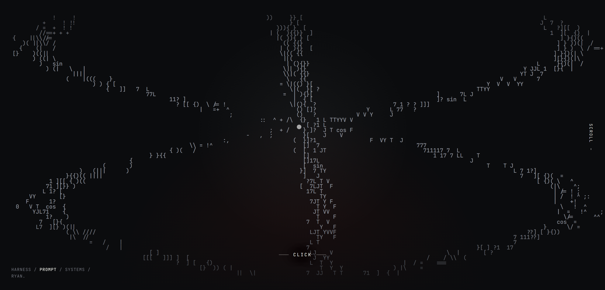
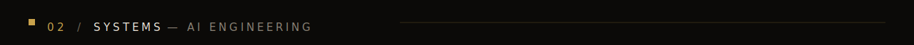
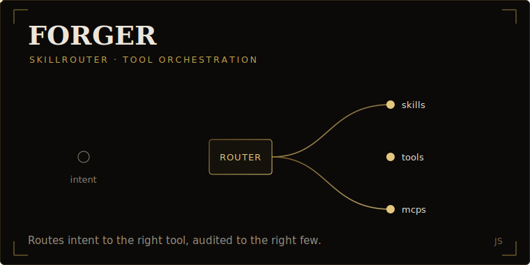
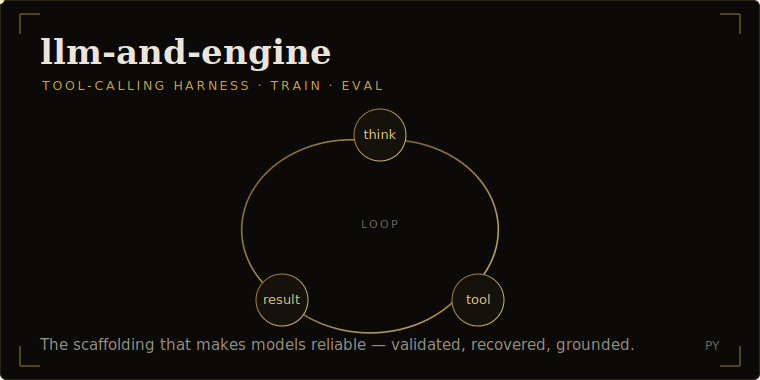
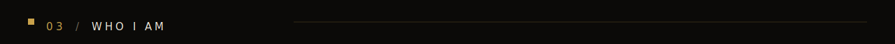

<!-- RyanDev1st · profile README · dark + gold, extends the Liquid Chess design language -->

  

 

<!-- ============================  WORK  ============================ -->

 

<table width="100%" cellspacing="0" cellpadding="7" border="0">
  <tr>
    <td colspan="2" align="center">
      
       
      <b>LIQUID&nbsp;CHESS</b>
       
      Real-time AI voice commentary for every opening, blunder and brilliancy.&nbsp;&nbsp;&nbsp;<a href="https://ryandev1st.github.io/LiquidChess/">live&nbsp;▸</a>&nbsp;&nbsp;<a href="https://github.com/RyanDev1st/LiquidChess">code&nbsp;▸</a>
    </td>
  </tr>
  <tr>
    <td width="50%" valign="top" align="center">
      
       
      <b>THE&nbsp;LIVE&nbsp;DEMO</b>
       
      Board, AI voice coach and live chat, scored in real time.
    </td>
    <td width="50%" valign="top" align="center">
      
       
      <b>YOUR&nbsp;GAME.&nbsp;THEIR&nbsp;VOICE.</b>
       
      Pick the voice that calls your game.
    </td>
  </tr>
  <tr>
    <td width="50%" valign="top" align="center">
      
       
      <b>A&nbsp;REAL&nbsp;PRODUCT</b>
       
      <code>import&nbsp;{&nbsp;LiquidChess&nbsp;}</code>, commentary shipped as an API.
    </td>
    <td width="50%" valign="top" align="center">
      
       
      <b>PORTFOLIO</b>
       
      An interactive ASCII world: harness, prompt, systems.&nbsp;&nbsp;&nbsp;<a href="https://ryandev1st.github.io/portfolio-design/">visit&nbsp;▸</a>
    </td>
  </tr>
</table>

 

<!-- ============================  SYSTEMS  ============================ -->

 

<table width="100%" cellspacing="0" cellpadding="6" border="0">
  <tr>
    <td width="50%" valign="top" align="center">
      
    </td>
    <td width="50%" valign="top" align="center">
      
    </td>
  </tr>
</table>

  More&nbsp;&nbsp;&nbsp;<a href="https://github.com/RyanDev1st/Chess-Data">Chess-Data</a>&nbsp;&nbsp;&nbsp;<a href="https://jack-sparrow-plum.vercel.app">Jack-Sparrow&nbsp;(live)</a>&nbsp;&nbsp;&nbsp;<a href="https://github.com/RyanDev1st/Apoc-Popper">Apoc-Popper</a>&nbsp;&nbsp;&nbsp;<a href="https://github.com/RyanDev1st?tab=repositories">all repos&nbsp;▸</a>

 

<!-- ============================  ABOUT  ============================ -->

 

> **I'm not a coder who bolts AI on. I'm an AI engineer.**
>
> I work the layer most people skip: the **harness, the prompt, the context**. I audit an agent's **skills, tools and MCPs down to the right few**, so it thinks clean and runs lean instead of drowning in options. Lately I'm pivoting deeper into **system design**.
>
> And when something needs to be *seen*, I design it myself. Striking, layered, intentional web with real depth. **No AI slop.**

 

  
  
  
  
  
  
  
  
  
  

 

<!-- ============================  CONNECT  ============================ -->

 

  
  &nbsp;
  
  &nbsp;
  
  &nbsp;
  

 

<i>Elevate your experience.</i>

